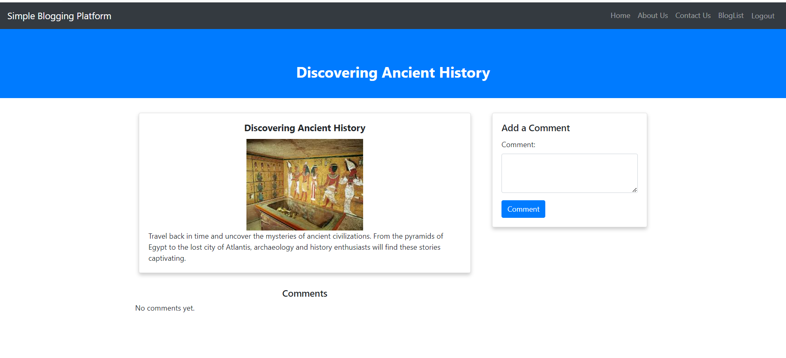

# Blog App

# Description
Welcome to the Blog App! This platform enables users to view,  comment on blogs. This README.md file will guide you through the steps to run the project locally.


## Table of Contents

- [Features](#features)
- [Getting Started](#getting-started)
- [Usage](#usage)
- [Code Structure](#code-structure)
- [Screenshots](#screenshots)
- [Author](#Author)

## Features

- **Login:** When user (any username/pass) login , he can access the bloglist and details.
- **Logout:** Aftre logout navbar changes and user redirect to homepage.
- **All Blogs:** View a list of all blogs available on the platform.
- **Read Blog:** Dive into the content of each blog to explore new ideas and stories.
- **Add Comments:** Engage with the blogs by adding comments to share your thoughts and opinions.
- **About Us:** This page contains about us details.
- **Contact Us:** This page have a form to contact us.


## Getting Started

### Prerequisites

- Node.js and npm (Node Package Manager) installed on your computer.
- Node.js: [Download and Install Node.js](https://nodejs.org/)

Follow these steps to run the Blog App locally:

1. **Unzip the Blog App:**

2. **Navigate to the project directory:**

   ```bash
   cd Blog-App
   ``` 

2. **Install Dependencies:**

   ```bash
   npm install react-router-dom
   ``` 

3. **Run:**
 - `Start Project`
   ```bash
      npm start
   ``` 
 - `Test Project`
   ```bash
      npm test
   ``` 
 - `Test Coverage`
   ```bash
      npm run coverage
   ``` 


## Usage

1. **Login:** 
2. **Logout**
3. **View All Blogs:** 
4. **Add Comments:**
5. **Read a Blog:**

## Code Structure

The project follows a structured directory layout for better organization:

- **public/**: Public files like HTML and manifest.
  - `images/`: Folder containing project images. 
  - `index.html`: The HTML template file where the React app is mounted.
  - `manifest.json`: The manifest file for progressive web apps.


- **ScreenShots**: Folder conatining screenshots here.

- **src/**: Contains the source code of the project.
  - **allComponents/**: React components.
    - `DummyData`: 
       - `blogs.js`
    - `Header.js`: Navbar resides in header.
    - `Home.js`: The home page component.
    - `BlogList.js`: The blog list page component.
    - `BlogDetail.js`: The blog detail page component.
    - `Login.js`: The login page component.
    - `ContactUs.js`: The contact us page component.
    - `AboutUs.js`: The about us page component.
  - **assets/**: Images, styles, and other assets.
    - `images/`: Folder containing project images.
    - `styles/`: Folder containing project CSS styles.
  - `App.js`: The main application file that sets up routing and renders components.

- `package.json`: The project dependencies and scripts configuration.

- `README.md`: This file, which provides an overview of the project's structure and usage instructions.

## Screenshots

<p align="center">
  
  
  
  
  
  
  
</p

- `Unit Test`
<p align="center">
  
</p

- `Jmeter Performance`
<p align="center">
  
</p


## Author

- SAURABH KUMAR RAI

